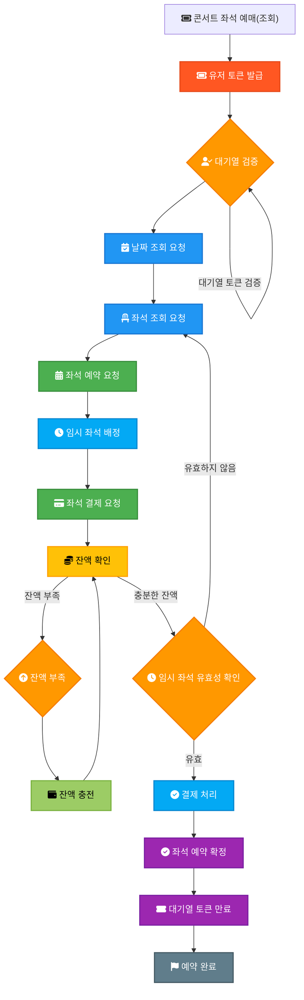
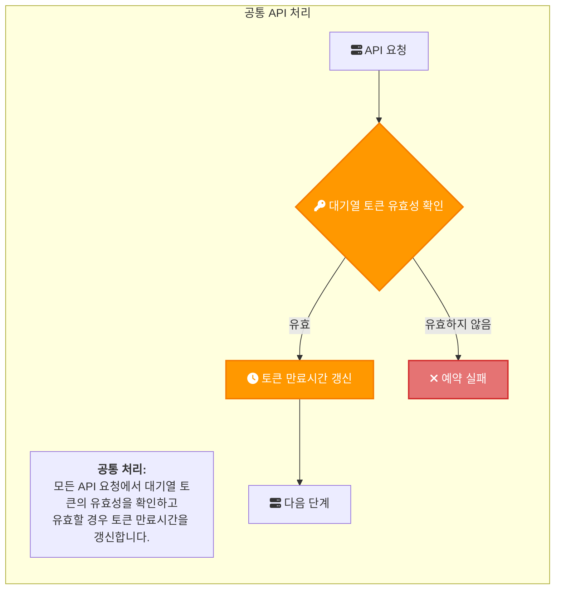

# 플로우 차트

```mermaid
flowchart TD
%% 시작 단계
    S["fa:fa-ticket 콘서트 좌석 예매(조회)"]
    A["fa:fa-ticket 유저 토큰 발급"]:::start

%% 검증 및 조건 분기 단계
    B{"fa:fa-user-check 대기열 검증"}:::validation
    Q{"fa:fa-clock 임시 좌석 유효성 확인"}:::validation

%% 데이터 조회 단계
    C["fa:fa-calendar-check 날짜 조회 요청"]:::data
    D["fa:fa-chair 좌석 조회 요청"]:::data

%% 잔액 관리 및 확인 단계
    H["fa:fa-coins 잔액 확인"]:::check
    P["fa:fa-wallet 잔액 충전"]:::charge
    N{"fa:fa-circle-arrow-up 잔액 부족"}:::validation

%% 상태 관리 및 처리 단계
    E["fa:fa-calendar-alt 좌석 예약 요청"]:::main
    F["fa:fa-clock 임시 좌석 배정"]:::action
    R["fa:fa-credit-card 좌석 결제 요청"]:::main
    I["fa:fa-check-circle 결제 처리"]:::action
    J["fa:fa-check-circle 좌석 예약 확정"]:::success
    K["fa:fa-ticket-alt 대기열 토큰 만료"]:::success

%% 종료 단계
    L["fa:fa-flag 예약 완료"]:::final

%% 주요 흐름 연결
    S --> A --> B --> C --> D --> E
    B -- 대기열 토큰 검증 --> B
    E --> F --> R --> H
    H -- 충분한 잔액 --> Q
    Q -- 유효하지 않음 --> D
    Q -- 유효 --> I --> J --> K --> L
    H -- 잔액 부족 --> N --> P --> H


%% 도형 스타일
    classDef start fill:#FF5722,stroke:#E64A19,color:#FFFFFF,stroke-width:2
    classDef main fill:#4CAF50,stroke:#388E3C,color:#FFFFFF,stroke-width:2
    classDef validation fill:#FF9800,stroke:#F57C00,color:#FFFFFF,stroke-width:2
    classDef data fill:#2196F3,stroke:#1976D2,color:#FFFFFF,stroke-width:2
    classDef check fill:#FFC107,stroke:#FFA000,color:#000000,stroke-width:2
    classDef charge fill:#9CCC65,stroke:#7CB342,color:#000000,stroke-width:2
    classDef action fill:#03A9F4,stroke:#0288D1,color:#FFFFFF,stroke-width:2
    classDef success fill:#9C27B0,stroke:#7B1FA2,color:#FFFFFF,stroke-width:2
    classDef final fill:#607D8B,stroke:#455A64,color:#FFFFFF,stroke-width:2
    classDef error fill:#E57373,stroke:#D32F2F,color:#FFFFFF,stroke-width:2


```

```mermaid

flowchart TD
%% 공통 API 처리 박스
    subgraph 공통 API 처리
    Note["<b>공통 처리:</b><br>모든 API 요청에서 대기열 토큰의 유효성을 확인하고<br>유효할 경우 토큰 만료시간을 갱신합니다."]:::note
        direction TB
        API["fa:fa-server API 요청"]
        NEXT["fa:fa-server 다음 단계"]
        T{"fa:fa-key 대기열 토큰 유효성 확인"}:::validation
        G["fa:fa-clock 토큰 만료시간 갱신"]:::validation
        T -- "유효" --> G
        G --> NEXT
        API --> T -- "유효하지 않음" --> X2["fa:fa-times 예약 실패"]:::error
    end

%% 도형 스타일
    classDef start fill:#FF5722,stroke:#E64A19,color:#FFFFFF,stroke-width:2
    classDef main fill:#4CAF50,stroke:#388E3C,color:#FFFFFF,stroke-width:2
    classDef validation fill:#FF9800,stroke:#F57C00,color:#FFFFFF,stroke-width:2
    classDef data fill:#2196F3,stroke:#1976D2,color:#FFFFFF,stroke-width:2
    classDef check fill:#FFC107,stroke:#FFA000,color:#000000,stroke-width:2
    classDef charge fill:#9CCC65,stroke:#7CB342,color:#000000,stroke-width:2
    classDef action fill:#03A9F4,stroke:#0288D1,color:#FFFFFF,stroke-width:2
    classDef success fill:#9C27B0,stroke:#7B1FA2,color:#FFFFFF,stroke-width:2
    classDef final fill:#607D8B,stroke:#455A64,color:#FFFFFF,stroke-width:2
    classDef error fill:#E57373,stroke:#D32F2F,color:#FFFFFF,stroke-width:2

```
