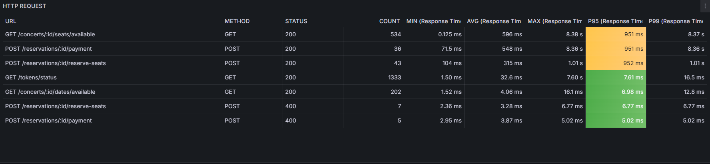

# 캐시 스탬피드(Cache Stampede) 현상

### **정의**

캐시 데이터가 만료되었을 때, 다수의 클라이언트가 동시에 원본 데이터베이스에 접근하여 과부하를 유발하는 현상

### **문제점**

* 데이터베이스 과부하
* 요청 지연으로 인한 시스템 장애 가능성

<figure><figcaption><p>캐시 스탬피드 현상<br><strong>캐시 만료 → 다수의 요청 → 데이터베이스 부하 증가 → 캐시 쓰기 경쟁</strong></p></figcaption></figure>

> * 어플리케이션이 [Cache Aside](rediscache-1.md#cache-aside)방식을 사용하여 키를 관리하는 경우에서  발생
> * 캐시된 데이터가 만료되었을 때 DB에 접근하여 데이터를 가져와서 캐시에 다시 저장하게 되는데, \
>   여러 어플리케이션이 동시에 특정 키가 만료되었을 경우 동시에 DB에 접근하여 데이터를 가져오려고 시도하는 과정에서 부하가 발생한다.

### **해결 방안**

1.  **캐시 만료 시간 분산**

    * 캐시 데이터의 TTL(Time-To-Live)을 분산시켜 동일 시점에 여러 키가 만료되지 않도록 설정

    ```java
    redisTemplate.opsForValue().set(key, value, randomTTL(), TimeUnit.SECONDS);
    ```
2.  **백그라운드 캐시 갱신 (캐시 프리로드(Preloading))**

    * 데이터가 만료되기 전에 백그라운드에서 주기적으로 캐시를 갱신

    ```java
    @Scheduled(fixedRate = 60000)
    public void refreshCache() {
        List<String> keys = getFrequentKeys();
        keys.forEach(key -> {
            Object data = database.fetchDataForKey(key);
            redisTemplate.opsForValue().set(key, data);
        });
    }
    ```
3.  **Mutex Lock(분산 잠금) 적용**

    * 캐시 미스 발생 시, 첫 번째 요청이 데이터를 가져오는 동안 다른 요청은 대기 상태로 유지

    ```java
    String lockKey = "lock:" + key;
    if (redisTemplate.opsForValue().setIfAbsent(lockKey, "1", 5, TimeUnit.SECONDS)) {
        try {
            // DB에서 데이터 조회 후 캐싱
            String value = database.findDataByKey(key);
            redisTemplate.opsForValue().set(key, value, 1, TimeUnit.HOURS);
        } finally {
            // 잠금 해제
            redisTemplate.delete(lockKey);
        }
    }

    ```
4.  **캐시 유지 연장 (Lazy Refresh)**

    * 캐시 만료 시점에 데이터를 삭제하지 않고, 만료된 데이터를 갱신

    ```java
    String value = redisTemplate.opsForValue().get(key);
    if (value == null) {
        // DB에서 조회 후 갱신
        value = database.findDataByKey(key);
        redisTemplate.opsForValue().set(key, value, 1, TimeUnit.HOURS);
    }
    ```

