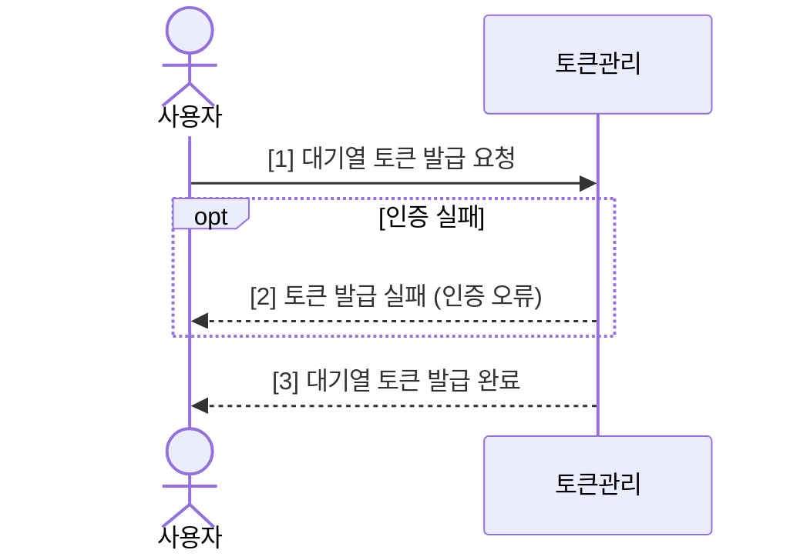
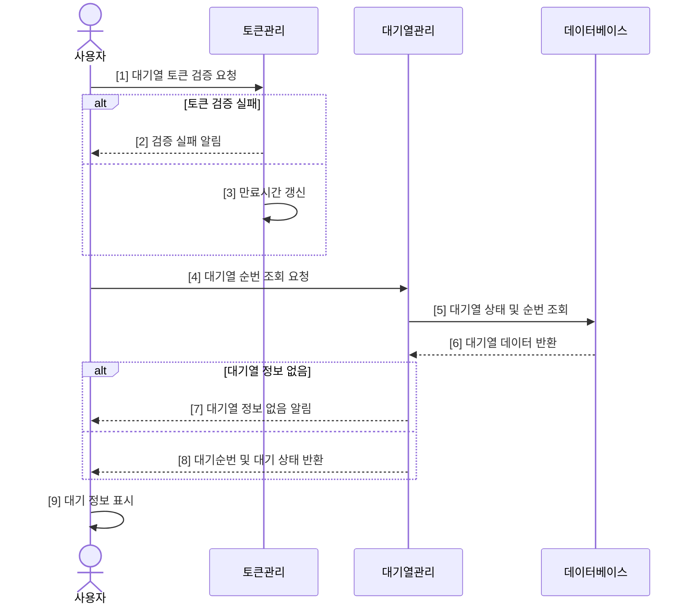
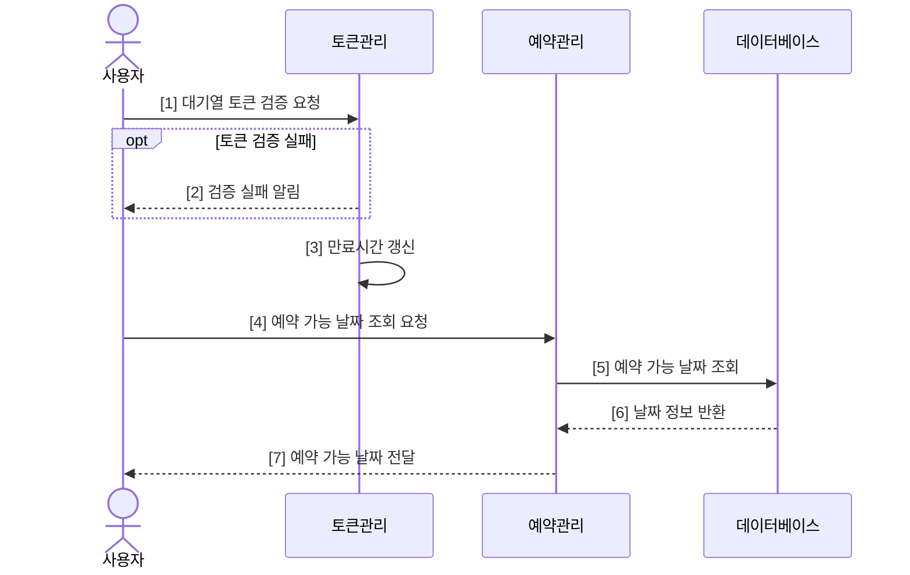
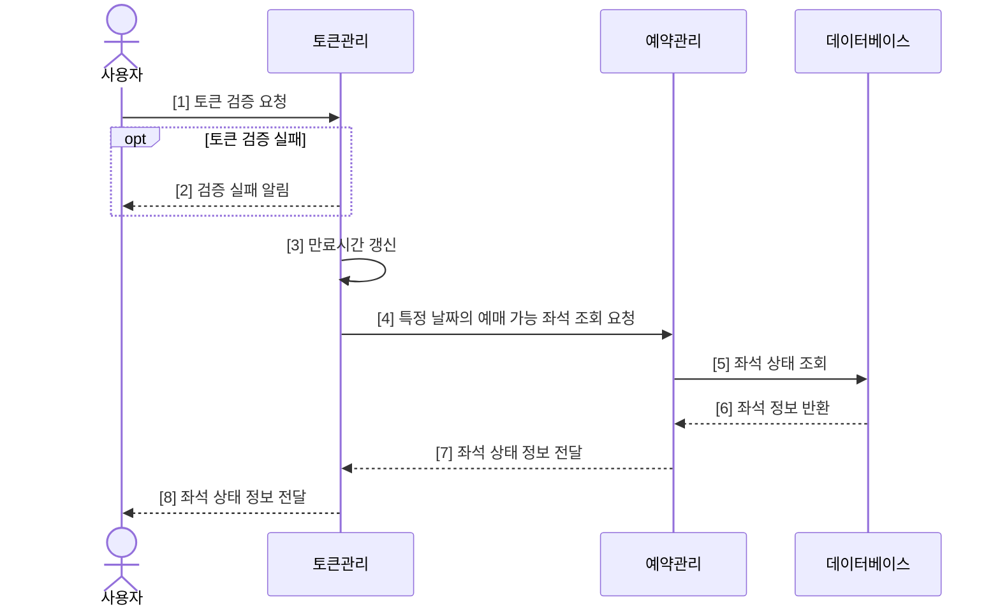
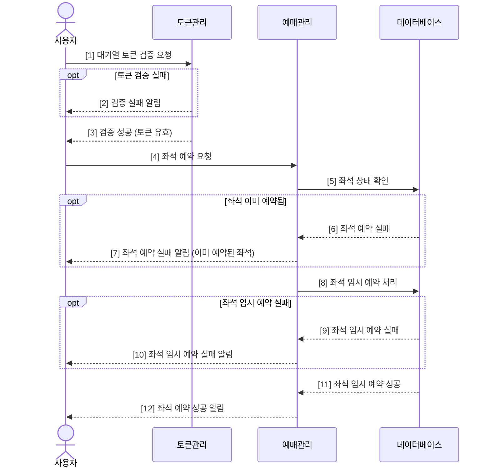
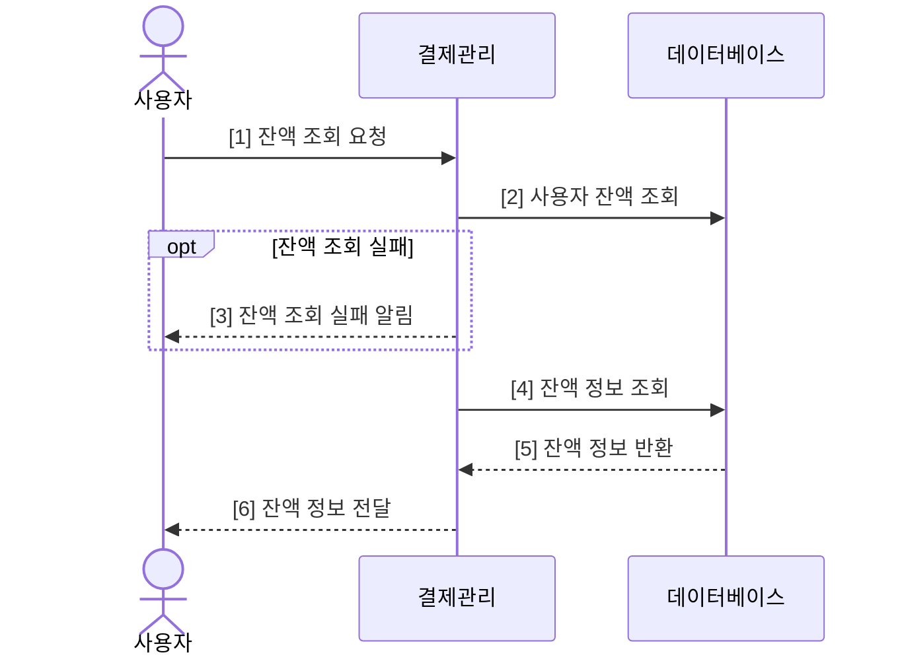
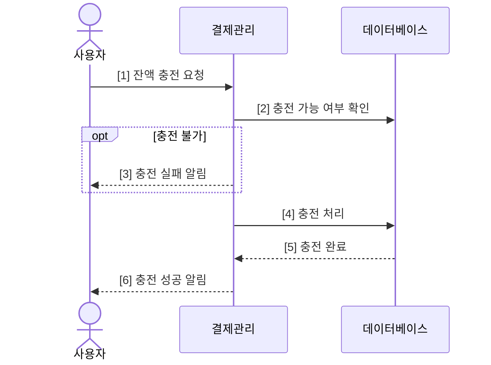
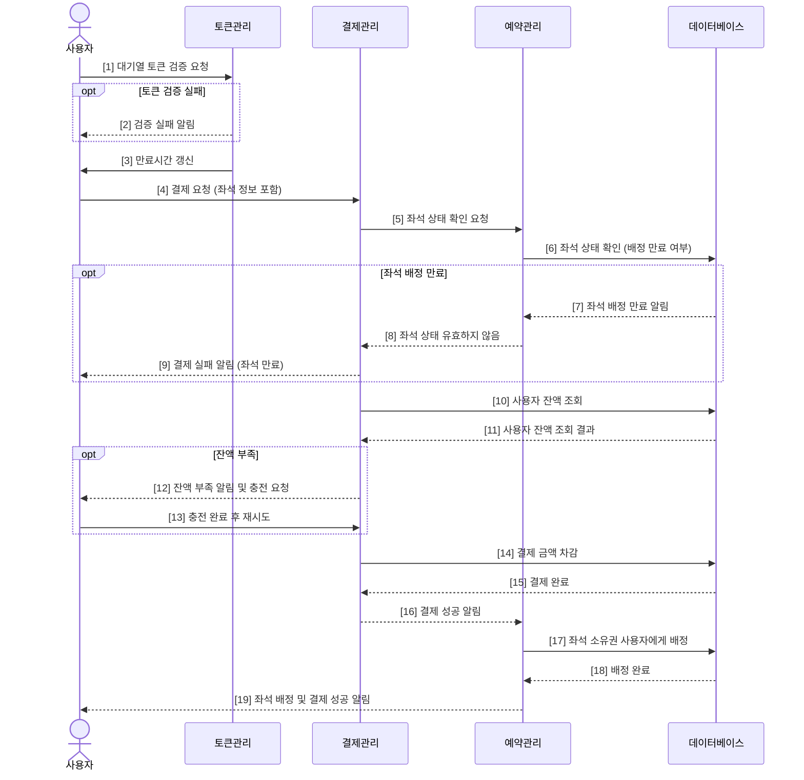

# 시퀀스 다이어그램


**대기열 토큰 발급**


***


**대기열 토큰 검증**


***


**예매 가능한 날짜 조회**


***


**특정 날짜의 예매 가능 좌석 조회**


***


**좌석 예약 요청**


***


**잔액 조회**


***


**잔액 충전**


***


**좌석 결제 요청**


<figure><figcaption></figcaption></figure>

